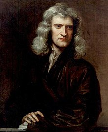

<table class="infobox biography vcard">
<tbody>
<tr>
<th colspan="2">

<a title="" href="https://en.wikipedia.org/wiki/Sir">Sir</a>

 

Isaac Newton

&nbsp;

</th>
</tr>
<tr>
<td colspan="2">

Portrait of Newton at 46 by&nbsp;<a title="Godfrey Kneller" href="https://en.wikipedia.org/wiki/Godfrey_Kneller">Godfrey Kneller</a>, 1689

</td>
</tr>
<tr>
<th scope="row">Born</th>
<td>

Isaac Newton

 4 January 1643 [<a title="Old Style and New Style dates" href="https://en.wikipedia.org/wiki/Old_Style_and_New_Style_dates">O.S.</a>&nbsp;25 December 1642] 

<a title="Woolsthorpe-by-Colsterworth" href="https://en.wikipedia.org/wiki/Woolsthorpe-by-Colsterworth">Woolsthorpe-by-Colsterworth</a>,&nbsp;<a title="Lincolnshire" href="https://en.wikipedia.org/wiki/Lincolnshire">Lincolnshire</a>,&nbsp;<a title="Kingdom of England" href="https://en.wikipedia.org/wiki/Kingdom_of_England">England</a>

</td>
</tr>
<tr>
<th scope="row">Died</th>
<td>31 March 1727&nbsp;(aged&nbsp;84) [<a title="Old Style and New Style dates" href="https://en.wikipedia.org/wiki/Old_Style_and_New_Style_dates">O.S.</a>&nbsp;20 March 1726] 

<a title="Kensington" href="https://en.wikipedia.org/wiki/Kensington">Kensington</a>,&nbsp;<a title="Middlesex" href="https://en.wikipedia.org/wiki/Middlesex">Middlesex</a>,&nbsp;<a title="Kingdom of Great Britain" href="https://en.wikipedia.org/wiki/Kingdom_of_Great_Britain">Great Britain</a>

</td>
</tr>
<tr>
<th scope="row">Resting place</th>
<td class="label"><a title="Westminster Abbey" href="https://en.wikipedia.org/wiki/Westminster_Abbey">Westminster Abbey</a></td>
</tr>
<tr>
<th scope="row">Nationality</th>
<td class="category">English</td>
</tr>
<tr>
<th scope="row">Education</th>
<td><a title="Trinity College, Cambridge" href="https://en.wikipedia.org/wiki/Trinity_College,_Cambridge">Trinity College, Cambridge</a>&nbsp;(M.A., 1668)</td>
</tr>
<tr>
<th scope="row">Known&nbsp;for</th>
<td>

<ul>
<li><a title="Classical mechanics" href="https://en.wikipedia.org/wiki/Classical_mechanics">Newtonian mechanics</a></li>
<li><a class="mw-redirect" title="Universal gravitation" href="https://en.wikipedia.org/wiki/Universal_gravitation">Universal gravitation</a></li>
<li><a title="Calculus" href="https://en.wikipedia.org/wiki/Calculus">Calculus</a></li>
<li><a title="Newton's laws of motion" href="https://en.wikipedia.org/wiki/Newton%27s_laws_of_motion">Newton's laws of motion</a></li>
<li><a title="Optics" href="https://en.wikipedia.org/wiki/Optics">Optics</a></li>
<li><a title="Binomial series" href="https://en.wikipedia.org/wiki/Binomial_series">Binomial series</a></li>
<li><em><a title="Philosophi&aelig; Naturalis Principia Mathematica" href="https://en.wikipedia.org/wiki/Philosophi%C3%A6_Naturalis_Principia_Mathematica">Principia</a></em></li>
<li><a title="Newton's method" href="https://en.wikipedia.org/wiki/Newton%27s_method">Newton's method</a></li>
</ul>

</td>
</tr>
<tr>
<th scope="row">Awards</th>
<td>

<ul>
<li><a title="Fellow of the Royal Society" href="https://en.wikipedia.org/wiki/Fellow_of_the_Royal_Society">FRS</a>&nbsp;(1672)</li>
<li><a title="Knight Bachelor" href="https://en.wikipedia.org/wiki/Knight_Bachelor">Knight Bachelor</a>&nbsp;(1705)</li>
</ul>

</td>
</tr>
<tr>
<td colspan="2"><strong>Scientific career</strong></td>
</tr>
<tr>
<th scope="row">Fields</th>
<td class="category">

<ul>
<li><a title="Physics" href="https://en.wikipedia.org/wiki/Physics">Physics</a></li>
<li><a title="Natural philosophy" href="https://en.wikipedia.org/wiki/Natural_philosophy">Natural philosophy</a></li>
<li><a title="Alchemy" href="https://en.wikipedia.org/wiki/Alchemy">Alchemy</a></li>
<li><a title="Theology" href="https://en.wikipedia.org/wiki/Theology">Theology</a></li>
<li><a title="Mathematics" href="https://en.wikipedia.org/wiki/Mathematics">Mathematics</a></li>
<li><a title="Astronomy" href="https://en.wikipedia.org/wiki/Astronomy">Astronomy</a></li>
<li><a title="Economics" href="https://en.wikipedia.org/wiki/Economics">Economics</a></li>
</ul>

</td>
</tr>
<tr>
<th scope="row">Institutions</th>
<td>

<ul>
<li><a title="University of Cambridge" href="https://en.wikipedia.org/wiki/University_of_Cambridge">University of Cambridge</a></li>
<li><a title="Royal Society" href="https://en.wikipedia.org/wiki/Royal_Society">Royal Society</a></li>
<li><a title="Royal Mint" href="https://en.wikipedia.org/wiki/Royal_Mint">Royal Mint</a></li>
</ul>

</td>
</tr>
<tr>
<th scope="row">Academic advisors</th>
<td>

<ul>
<li><a title="Isaac Barrow" href="https://en.wikipedia.org/wiki/Isaac_Barrow">Isaac Barrow</a></li>
<li><a title="Benjamin Pulleyn" href="https://en.wikipedia.org/wiki/Benjamin_Pulleyn">Benjamin Pulleyn</a></li>
</ul>

</td>
</tr>
<tr>
<th scope="row">Notable students</th>
<td>

<ul>
<li><a title="Roger Cotes" href="https://en.wikipedia.org/wiki/Roger_Cotes">Roger Cotes</a></li>
<li><a title="William Whiston" href="https://en.wikipedia.org/wiki/William_Whiston">William Whiston</a></li>
</ul>

</td>
</tr>
<tr>
<th colspan="2">Signature</th>
</tr>
<tr>
<td colspan="2"></td>
</tr>
</tbody>
</table>
 

 

<strong> Publications: </strong>

<ul>

 <li><a target="_blank" href="https://github.com/manjunath5496/Papers-of-Sir-Isaac-Newton/blob/master/tst(1).pdf" style="text-decoration:none;">The method of fluxions and infinite series : with its application to the geometry of curve-lines</a></li>
                            
 <li><a target="_blank" href="https://github.com/manjunath5496/Papers-of-Sir-Isaac-Newton/blob/master/tst(2).pdf" style="text-decoration:none;">A new theory of light and colours</a></li>

<li><a target="_blank" href="https://github.com/manjunath5496/Papers-of-Sir-Isaac-Newton/blob/master/tst(3).rar" style="text-decoration:none;">Opticks: or, A Treatise of the Reflexions, Refractions, Inflexions and Colours of Light</a></li>
 <li><a target="_blank" href="https://github.com/manjunath5496/Papers-of-Sir-Isaac-Newton/blob/master/tst(4).pdf" style="text-decoration:none;">The Principia: Mathematical Principles of Natural Philosophy</a></li> 
 

<li><a target="_blank" href="https://github.com/manjunath5496/Papers-of-Sir-Isaac-Newton/blob/master/n(1).pdf" style="text-decoration:none;">The Mathematical Papers of Isaac Newton: Volume 6</a></li>
 <li><a target="_blank" href="https://github.com/manjunath5496/Papers-of-Sir-Isaac-Newton/blob/master/n(2).pdf" style="text-decoration:none;">Observations upon the Prophecies of Daniel, and the Apocalypse of St. John</a></li>  
 
</ul>

 
